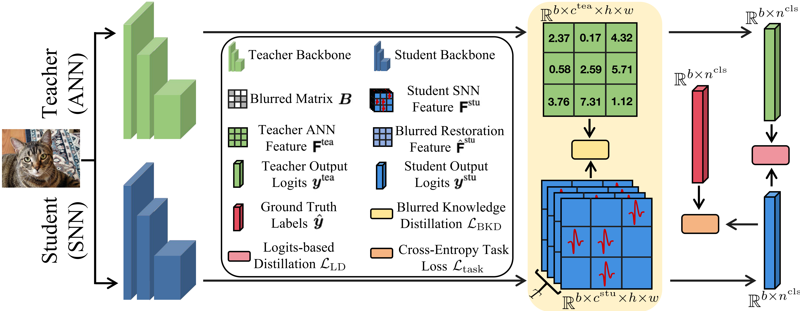

<div align="center"><h1>&nbsp;BKDSNN: Enhancing the Performance of Learning-based Spiking Neural Networks Training with Blurred Knowledge Distillation</h1></div>


<p align="center">
| <a href="http://arxiv.org/pdf/2407.09083"><b>Paper</b></a> | <a href="http://arxiv.org/pdf/2407.09083"><b>Blog</b></a> |
</p>


<p align="center">
  <a href="https://opensource.org/license/mulanpsl-2-0">
    
  </a>
  <a href="https://github.com/">
    
  </a>
  <a href="https://github.com/">
    
  </a>
</p>


## Contents
- [News](#news)
- [Introduction](#introduction)
- [Usage](#Usage)
- [Acknowledgement](#Acknowledgement)
- [Contact](#Contact)
  
## News

- [2024/7] Code of BKDSNN is released!
- [2024/11] Checkpoints for ImageNet and CIFAR are released!

## Introduction




This is the official project repository for BKDSNN: Enhancing the Performance of Learning-based Spiking Neural Networks Training with Blurred Knowledge Distillation, which has been accepted by ECCV2024. If you find this repository helpful, Please kindly cite:
```
@inproceedings{
spikeziptf2024,
title={BKDSNN: Enhancing the Performance of Learning-based Spiking Neural Networks Training with Blurred Knowledge Distillation},
author={Zekai Xu and Kang You and Qinghai Guo and Xiang Wang and Zhezhi He},
booktitle={18th European Conference on Computer Vision(ECCV)},
year={2024}
}
```

## Usage

### Preparation
#### For Environment: For Spikingformer-CML, we follow the environment from [Spikingformer-CML](https://github.com/zhouchenlin2096/Spikingformer-CML). For Spike-Element-Wise-ResNet, we follow the environment from [Spike-Element-Wise-ResNet](https://github.com/fangwei123456/Spike-Element-Wise-ResNet) (Note that we use the previous version with spikingjelly==0.0.0.0.4). 
#### For Dataset: Prepare ImageNet1K, CIFAR-10, CIFAR-100 and CIFAR10-DVS.


### Train

#### For ImageNet-1K on CML + Spikingformer-8-768 with mixed distillation
```
cd Spikingformer-CML/imagenet/scripts/mixed
bash run_b.sh
```

#### For ImageNet-1K on SEW-ResNet50 with mixed distillation
```
cd Spike-Element-Wise-ResNet/imagenet
CUDA_VISIBLE_DEVICES=0,1,2,3 python -m torch.distributed.launch --nproc_per_node=4 --use_env train_distillation.py \
                                                           --cos_lr_T 320 \
                                                           --model sew_resnet50 -b 128 \
                                                           --model_teacher resnet50 \
                                                           --output-dir ./logs --tb --print-freq 64 \
                                                           --amp --cache-dataset --connect_f ADD --T 4 \
                                                           --lr 0.1 --epoch 320 --data-path /data/for/imagenet \
                                                           --distill_type mixed --teacher_channel 512 --student_channel 512 \
```

### Performance

#### Main results on ImageNet-1K([ViT-Base here](https://pan.baidu.com/s/1fEMiX34dcIxpmc8VxIGn6A?pwd=k3tf), we use the pretrained checkpoint from torchvision for ResNet.)

| Student                   | Teacher   | T     |  Param.     |Top-1 Acc| Download |
| :---                      | :---:     | :---: | :---:        |:---:    | :---:    |
| CML + Spikingformer-8-384(74.35) | ViT-Base(81.78)  | 4     |  16.81M     |75.48(+1.13)   |     -    |
| CML + Spikingformer-8-512(76.54) | ViT-Base(81.78)  | 4     |  29.68M     |77.24(+0.70)    | [here](https://pan.baidu.com/s/1fTubmtw1iwLWFe3kAmovXw?pwd=3agw) |
| CML + Spikingformer-8-768(77.64) | ViT-Base(81.78)  | 4     |  66.34M     |79.93(+2.29)    | [here](https://pan.baidu.com/s/1QS0n8S5K3Dak9UIa1Zzrnw?pwd=np8h) |
| SEW-ResNet18(63.18) | ResNet18(69.76)  | 4     |  11.69M     |65.60(+2.42)   |     -    |
| SEW-ResNet34(67.04) | ResNet34(71.24)  | 4     |  21.79M     |77.24(+4.20)    | [here](https://pan.baidu.com/s/1cncSXl-53Xiudszt0aEosg?pwd=aa5q) |
| SEW-ResNet50(67.78) | ResNet50(72.32)  | 4     |  25.56M     |79.93(+4.54)    | [here](https://pan.baidu.com/s/1pMBCaGaD7X7-CLBBsJ2xOg?pwd=mms3) |

#### Main results on CIFAR-100([teacher-model here](https://pan.baidu.com/s/1-shM8d8Nvm_dY7LokuPGEw?pwd=3v2k))

| Student                   | Teacher   | T     |  Param.     |Top-1 Acc| Download |
| :---                      | :---:     | :---: | :---:        |:---:    | :---:    |
| CML + Spikingformer-4-256(78.19) | ViT-Small(82.22)  | 4     |  4.15M     |79.41(+1.22)   |  [here](https://pan.baidu.com/s/1wh9NHNwD10mrcb149USBXA?pwd=9i69) |
| CML + Spikingformer-2-384(78.87) | ViT-Small(82.22)  | 4     |  5.76M     |80.63(+1.76)    | [here](https://pan.baidu.com/s/1mFTOEm_5rk20B-l0WThGLA?pwd=4ov9) |
| CML + Spikingformer-4-384(79.98) | ViT-Small(82.22)  | 4     |  9.32M     |81.26(+1.28)    | [here](https://pan.baidu.com/s/1aj3GDwgGTFNjFC1L8A_GdQ?pwd=v8qq) |

#### Main results on CIFAR-10([teacher-model here](https://pan.baidu.com/s/1pe3Am9FV7bxvrYiYNoiKhA?pwd=i8ll))

| Student                   | Teacher   | T     |  Param.     |Top-1 Acc| Download |
| :---                      | :---:     | :---: | :---:        |:---:    | :---:    |
| CML + Spikingformer-4-256(94.94) | ViT-Small(96.75)  | 4     |  4.15M     |95.29(+0.35)   |  [here](https://pan.baidu.com/s/1cyTRwtr7-iPOwIHlkIVkHg?pwd=wvpa) |
| CML + Spikingformer-2-384(95.54) | ViT-Small(96.75)  | 4     |  5.76M     |95.90(+0.36)    | [here](https://pan.baidu.com/s/1ERW9mF2dqFwMnzJgz-TsGw?pwd=rn2g) |
| CML + Spikingformer-4-384(95.81) | ViT-Small(96.75)  | 4     |  9.32M     |96.06(+0.25)    | [here](https://pan.baidu.com/s/1kfc5qjUx_g0wShfiFGs3Ag?pwd=iuct) |

## Acknowledgement
Related project: [Spikingformer-CML](https://github.com/zhouchenlin2096/Spikingformer-CML), [Spike-Element-Wise-ResNet](https://github.com/fangwei123456/Spike-Element-Wise-ResNet), [spikingjelly](https://github.com/fangwei123456/spikingjelly).

For help or issues using this git, please submit a GitHub issue.

## Contact
For other communications related to this git, please contact sherlock.holmes.xu@sjtu.edu.cn.
